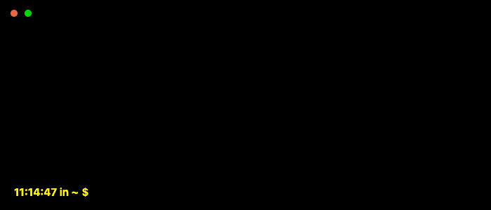

# Welcome to Service Level Helper Documentation

  

Service Level Helper (slh) is a command-line interface (CLI) tool, written in Go, designed to assist Site Reliability Engineers (SRE), DevOps professionals, and similar roles in calculating the maximum allowable downtime based on a given service level objective or agreement.

## Features

- Calculates the maximum allowable downtime for daily, weekly, monthly, quarterly, and yearly periods with a given service level objective or agreement, known as Error Budget.
- Calculates the minimum probing frequency necessary to keep your Service Level inside specific time periods.
- Supports custom Mean Time to Repair (MTTR), expected incidents, and number of probes to alert for the probing frequency calculation.
- Calculates your Service Level based on the total duration of outages and the total duration of the monitoring period.
- Provides a simple and easy-to-use command-line interface made with [urfave/cli](https://cli.urfave.org/)

Service Level Helper is licensed under the Apache License, Version 2.0. See [LICENSE](https://www.apache.org/licenses/LICENSE-2.0) for the full license text.
